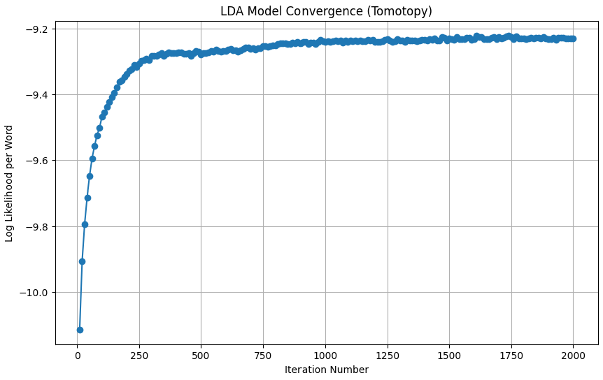
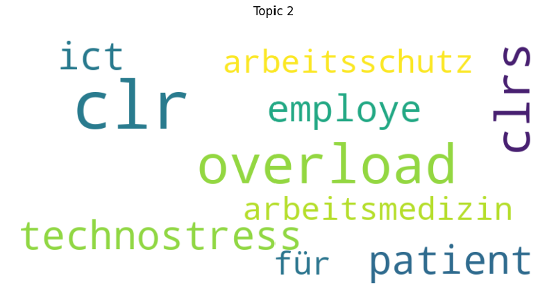

# LDA Quick Start

## Installation

The tested python-version for this project is `3.12.6`

(Optional) It is recommended to use a virtual environment (venv) for this project. You can create a venv using the following command: 
```bash
python -m venv .venv
```

Now activate the venv (Windows): 
```bash
.venv/Scripts/activate
```
(Mac/Linux)
```bash
source .venv/bin/activate
```

To install the requirements run 
```bash
pip install -r requirements.txt
```

Now install the ipykernel
```bash
python -m ipykernel install --user --name lda_quick_start 
```

## Getting Started

After the installation you need to add the texts you want to perform topic-modeling on to the `dokumente` folder. 
Supported file-types are: 

* txt 
* pdf
* docx

Now you can run the notebook `topicmodeling.ipynb`.
Make sure you use the `lda_quick_start` ipykernel and run each cell sequentially. 
Hyperparameters you can change are typically found right after the imports at the top of each cell. 
Feel free to experiment. 

## Results: 

The following example results were generated by performing topicmodeling on a subset of the papers I read the last year.

### Training LogLikelyhood per Word Plot



### Topic Words

#### Topic 2
| Word             | Probability |
|------------------|-------------|
| clr              | 0.0207      |
| overload         | 0.0129      |
| clrs             | 0.0098      |
| technostress     | 0.0066      |
| patient          | 0.0065      |
| ict              | 0.0061      |
| employe          | 0.0057      |
| arbeitsschutz    | 0.0043      |
| arbeitsmedizin   | 0.0043      |
| für              | 0.0043      |

#### Topic 3
| Word             | Probability |
|------------------|-------------|
| code             | 0.0145      |
| icd              | 0.0118      |
| tweet            | 0.0099      |
| trump            | 0.0094      |
| yd               | 0.0094      |
| codebook         | 0.0080      |
| xd               | 0.0072      |
| incontext        | 0.0067      |
| coder            | 0.0057      |
| llms             | 0.0056      |

### Word Clouds

